<div align="center">


<a href="https://git.io/typing-svg">
  
</a>

<br/>


<br/><br/>

<a href="https://praneetha-portfolio.vercel.app/">
  
</a>
<a href="https://linkedin.com/in/naga-praneetha-kanna">
  
</a>
<a href="mailto:nagapraneethakanna0827@gmail.com">
  
</a>
<a href="https://github.com/praneetha0827">
  
</a>

<br/><br/>


</div>

<br/>

## ⟡ About Me


```yaml
whoami:
  name: "Kanna Naga Praneetha"
  role: "Software Engineer — Full Stack & Generative AI"
  education: "B.Tech, Information Technology (CGPA: 8.5)"
  focus: ["Frontend Engineering", "Generative AI / LLMs", "Full Stack Development"]
  philosophy: "Ship clean, scalable, user-centric products — backed by strong CS fundamentals."
```

I'm an engineering student specializing in **frontend development** and **Generative AI**, with a strong foundation in **full-stack engineering**. I build responsive, component-based UIs with **React** and **JavaScript (ES6+)**, integrate REST APIs with production discipline, and design intelligent, AI-powered applications using **Python, Flask, and LLM tooling**.

My approach blends a **product engineering mindset** — clean UI states, graceful error handling, modular architecture — with a genuine curiosity for how **AI systems and prompt-driven applications** are reshaping software. I care about writing code that is readable, testable, and built to scale.

<table align="center">
<tr>
<td align="center" width="25%">🧠<br/><b>Generative AI</b></td>
<td align="center" width="25%">🎨<br/><b>Frontend Engineering</b></td>
<td align="center" width="25%">⚙️<br/><b>Full Stack Dev</b></td>
<td align="center" width="25%">☁️<br/><b>Cloud & DevOps</b></td>
</tr>
</table>

### 🎯 Open To

<div align="center">

`GenAI Developer Internship` &nbsp;•&nbsp; `Frontend Developer Roles` &nbsp;•&nbsp; `Full Stack Engineering` &nbsp;•&nbsp; `Software Engineering Internship` &nbsp;•&nbsp; `Open Source Collaboration`

</div>

---

## ⟡ Education

<div align="center">

| Qualification | Institution | Score | Years |
|---|---|:---:|:---:|
| **B.Tech, Information Technology** | Seshadrirao Gudlavalleru Engineering College | 8.5 CGPA | 2023 – 2027 |
| **Intermediate (MPC)** | SR Junior College, Gollapudi | 89.8% | 2021 – 2023 |
| **SSC** | St. Anne's High School, Guntupalli | 99.3% | 2020 – 2021 |

</div>

---

## ⟡ Tech Stack

<div align="center">

**Languages**


**Frontend**


**Backend & Databases**


**Cloud, DevOps & Tooling**


**Core CS**

`Data Structures & Algorithms` &nbsp;•&nbsp; `Object-Oriented Programming` &nbsp;•&nbsp; `Component-Based Architecture`

</div>

---

## ⟡ AI / ML Expertise

<div align="center">

| Domain | Proficiency | Details |
|---|:---:|---|
| **Generative AI** | ⭐⭐⭐⭐☆ | AWS Generative AI Foundations certified; hands-on with AI-powered application design |
| **Prompt Engineering** | ⭐⭐⭐⭐☆ | Designing structured prompts for reliable, task-oriented LLM outputs |
| **Machine Learning** | ⭐⭐⭐☆☆ | AI & ML internship program; IBM SkillsBuild — AI Fundamentals |
| **AI Model Integration** | ⭐⭐⭐☆☆ | Integrating AI/REST APIs into full-stack applications with clean state handling |
| **AI Workflow Automation** | ⭐⭐⭐☆☆ | Automating application workflows using AI-driven logic and cloud services |

</div>

---

## ⟡ Featured Projects

<details open>
<summary><b>🧩 Learnhub — Full-Stack E-Learning Platform</b></summary>
<br/>

Designed a clean, modular frontend with a dynamic dashboard, backed by a secure authentication system and a normalized relational database. Built responsive pages and reusable UI components, integrating them with backend CRUD operations over MySQL, with a focus on optimized queries and maintainable code structure.

| Attribute | Detail |
|---|---|
| **Stack** | HTML5, CSS3, JavaScript, Bootstrap, PHP, MySQL |
| **Scale** | Multi-page platform with dashboard, auth, and content modules |
| **Performance** | Optimized MySQL queries, modular reusable components |
| **Security** | Secure authentication & session-based access control |
| **Impact** | End-to-end e-learning workflow from login to content delivery |
| **Repository** | [View Repo](https://github.com/praneetha0827/learnhub) |

</details>

<details>
<summary><b>📈 Stocker — Cloud-Based Stock Trading Application</b></summary>
<br/>

Built a cloud-hosted trading simulation enabling users to trade, track live market data, and manage portfolios securely. Deployed using Flask and AWS services, applying core principles of reliability and scalable architecture.

| Attribute | Detail |
|---|---|
| **Stack** | Python, Flask, AWS (EC2/S3), REST APIs |
| **Scale** | Cloud-deployed simulation with live market data feeds |
| **Performance** | Flask-based backend optimized for concurrent trade simulation |
| **Security** | Secure user portfolio and transaction handling |
| **Impact** | Demonstrates production-style cloud deployment & reliability principles |
| **Repository** | [View Repo](https://github.com/praneetha0827/stocker) |

</details>

<details>
<summary><b>📝 Online Quiz Application — Java, Spring Boot</b></summary>
<br/>

Built a full-stack, object-oriented quiz platform applying class-based design to model users, questions, and scoring logic. Implemented user registration, multiple-choice question attempts, and result tracking with a modular, testable backend architecture.

| Attribute | Detail |
|---|---|
| **Stack** | Java, Spring Boot, Maven, HTML/CSS |
| **Scale** | Multi-user quiz engine with scoring & result tracking |
| **Performance** | Modular, testable backend architecture |
| **Security** | User registration with validated attempt tracking |
| **Impact** | OOP-driven design applied to a real assessment workflow |
| **Repository** | [View Repo](https://github.com/praneetha0827/online-quiz-app) |

</details>

<details>
<summary><b>🌦️ Weather Prediction App — JavaScript, REST API</b></summary>
<br/>

Built a responsive weather forecast interface consuming a public weather REST API and rendering live data, with a focus on clean UI state management and graceful handling of loading/error states.

| Attribute | Detail |
|---|---|
| **Stack** | JavaScript, REST API, HTML5, CSS3 |
| **Scale** | Single-page responsive weather dashboard |
| **Performance** | Efficient async API state handling |
| **Security** | Client-side API key handling best practices |
| **Impact** | Clean UX for real-time, error-resilient data rendering |
| **Repository** | [View Repo](https://github.com/praneetha0827/weather-app) |

</details>

<details>
<summary><b>🎮 Frontend Project Collection — Vanilla JS</b></summary>
<br/>

A collection of interactive, client-side web applications including a Sudoku generator, a Snake game, a sales analytics dashboard, a world population explorer, and a Quicksort algorithm visualizer — built with vanilla JavaScript, focused on DOM manipulation and reusable UI logic without a framework.

| Attribute | Detail |
|---|---|
| **Stack** | HTML5, CSS3, JavaScript (Vanilla) |
| **Scale** | 5 standalone interactive applications |
| **Performance** | Framework-free DOM logic optimized for responsiveness |
| **Security** | N/A — client-side only |
| **Impact** | Demonstrates strong JS fundamentals & algorithmic visualization |
| **Repository** | [View Repo](https://github.com/praneetha0827/frontend-project-collection) |

</details>

---

## ⟡ Experience

### Full Stack Development Intern — Internship Program
*Certified Program*

Completed an intensive full-stack internship covering end-to-end application development, from frontend UI implementation to backend integration and deployment fundamentals.

- Built and integrated responsive frontend components with backend services
- Practiced REST API design, CRUD operations, and database integration
- Collaborated on real-world style project deliverables under structured milestones

`JavaScript` `REST APIs` `MySQL` `Git`

<br/>

### AI & Machine Learning Intern — Internship Program
*Certified Program*

Completed a focused internship on artificial intelligence and machine learning fundamentals, applying core ML concepts to practical exercises.

- Explored supervised learning workflows and model evaluation basics
- Applied AI concepts to small-scale practical implementations
- Strengthened foundations in Python-based ML tooling

`Python` `Machine Learning` `AI Fundamentals`

<br/>

### AWS Cloud Virtual Internship — AWS Global Certification
*Cloud Computing Track*

Completed a virtual internship on cloud computing fundamentals as part of the AWS Global Certification track.

- Explored core AWS services including EC2 and S3
- Practiced deploying and managing simple cloud-hosted applications
- Built foundational understanding of scalable cloud architecture

`AWS` `EC2` `S3` `Cloud Computing`

---

## ⟡ Achievements

<div align="center">

| Recognition | Details |
|---|---|
| 🎓 **Academic Excellence** | 8.5 CGPA in B.Tech Information Technology |
| 🥇 **SSC Distinction** | 99.3% in Board of Secondary Education, Andhra Pradesh |
| 🥈 **Intermediate Distinction** | 89.8% in Board of Intermediate Education (MPC), Andhra Pradesh |
| ☁️ **AWS Certified Track** | Completed AWS Cloud Practitioner Essentials & Generative AI Foundations |
| 🤖 **AI/ML Internship** | Completed dedicated AI & Machine Learning internship program |
| 💻 **Full Stack Internship** | Completed end-to-end Full Stack development internship |

</div>

---

## ⟡ Certifications

<div align="center">

**AWS**


**Cisco**


**IBM**


**Other**


</div>

---

## ⟡ Coding Profiles

<div align="center">

<a href="https://leetcode.com/praneetha_kanna">
  
</a>
<a href="https://www.codechef.com/users/praneetha_0827">
  
</a>

</div>

---

## ⟡ GitHub Analytics

<p align="center">
  
  
</p>


## ⟡ Contribution Activity

<div align="center">

  

</div>

---

## ⟡ Contribution Snake

<div align="center">


</div>

---

## ⟡ Current Focus

```yaml
current_focus:
  learning:
    - "Large Language Model (LLM) application development"
    - "Advanced React patterns & performance optimization"
    - "System design fundamentals"
  building:
    - "AI-powered full-stack applications"
    - "Component-driven, production-grade UI systems"
  exploring:
    - "AI workflow automation"
    - "Cloud-native deployment (AWS)"
  open_to:
    - "GenAI Developer Internships"
    - "Frontend / Full Stack Engineering roles"
    - "Open-source collaboration"
```

---

## ⟡ Connect With Me

<div align="center">

<a href="mailto:nagapraneethakanna0827@gmail.com">
  
</a>
<a href="https://linkedin.com/in/naga-praneetha-kanna">
  
</a>
<a href="https://github.com/praneetha0827">
  
</a>
<a href="https://praneetha-portfolio.vercel.app/">
  
</a>

</div>

---

<div align="center">

*"Clean code, thoughtful design, and a relentless curiosity for AI — that's how I build."*


</div>